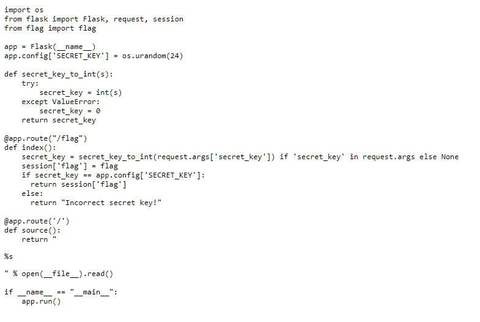
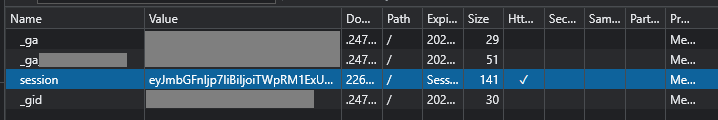

# 247CTF
## Secured Session -  Solution

The challenge description is:
> If you can guess our random secret key, we will tell you the flag securely stored in your session.

Opening the web challenge url shows this page:


The page contains the Python Flask code that the challenge runs on.  There is a randomly generated `SECRET_KEY` initialised at the start of the application. The URL path `/flag` can take a `secret_key` GET parameter, which then is compared with the global `SECRET_KEY`. If there is a match, the server will return the flag in the response. However, before performing the comparison, the code stores the flag in the client `session` cookie. In Flask, by default, the session cookie is a base64 encoding of the JSON serialized contents of the `session` variable.



Taking the value of the `session` cookie

```
eyJmbGFnIjp7IiBiIjoiTWpRM1ExUkdlMlJoT0RBM09UVm1PR0UxWTJGaU1tVXdNemRrTnpNNE5UZ3dOMkk1WVRreGZRPT0ifX0.ZEKRAw.8g4JmFzltGhWs-Jzwn0Rmnskjmw
```

and decoding it from base64 presents this

```
{"flag":{" b":"MjQ3Q1RGe2RhODA3OTVmOGE1Y2FiMmUwMzdkNzM4NTgwN2I5YTkxfQ=="}}[random bytes]
```

Finally, the base64 decoded `flag` value is the challenge flag.

```
247CTF{da80795f8a5cab2e037d7385807b9a91}
```