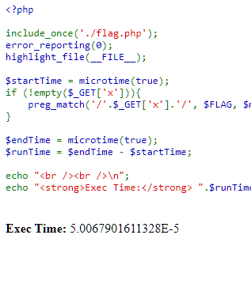

# Midnight Sun CTF 2023
## Matchmaker

Midnight Sun CTF: [https://play.midnightsunctf.com](https://play.midnightsunctf.com)
Team: [CVE2K9](https://cve2k9.club)

### Solution

Opening the challenge website shows, presumably, the PHP code behind it. The code indicated that a RegEx pattern can be given to the server by a GET parameter `x`. If `x` is set in the request, the PHP code will look for RegEx matches in the flag using the pattern set in `x`. It measures the time the matching takes and displays it at the bottom of the page.

I searched for possible attacks using RegEx that could give me some information and found an article about [Regular expression Denial of Service](https://owasp.org/www-community/attacks/Regular_expression_Denial_of_Service_-_ReDoS). Basically, there are some patterns that take slightly longer to execute than simpler patterns. I tried using `(((((.*)*)*)*)*)*)*` and it worked. Not too precisely - there was a lot of variance, so I wrote a script that sent requests to the server a couple times and averaged the "Exec Time".

Next, I needed to use that technique to gather information about the flag. I decided to make a pattern such that if it will execute the DoS part of the pattern if and only if it matches the beginning of the flag. The pattern that worked that way was:
`(midnight\{(((((.*)*)*)*)*)*)*`.

Now, I could add one more character to the flag and see if the average "Exec Time" over 5 tries is longer than if I added a different character - i.e.:

- `(midnight\{a(((((.*)*)*)*)*)*)*`
- `(midnight\{b(((((.*)*)*)*)*)*)*`
- `(midnight\{d(((((.*)*)*)*)*)*)*`
- ...
- `(midnight\{q(((((.*)*)*)*)*)*)*`
- `(midnight\{r(((((.*)*)*)*)*)*)*`
- ...

In this case, with added `r`, the "Exec Time" was reliably longer than for other characters. Other characters had a shorter "Exec Time" because the pattern didn't match before getting to the DoS part.

I ran this process automatically in Python, trying all characters in `string.printable` except whitespace, at each step adding the letter that had the longest "Exec Time" until I got the entire flag.

The server died a couple times during the challenge with too many tiny DoS patterns, meant to cause tiny delays, in requests from many contestants, compounding to DDoSing the server.